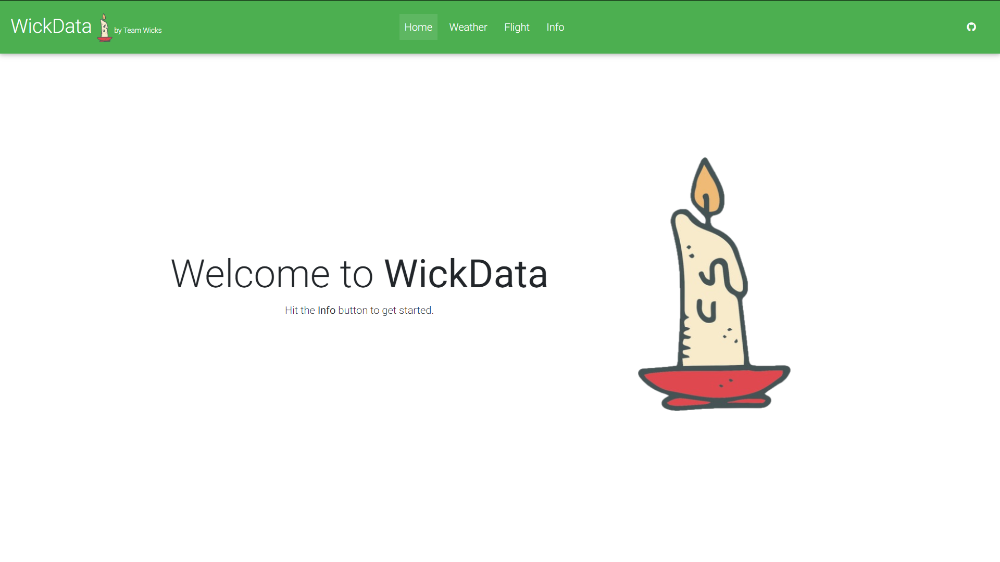
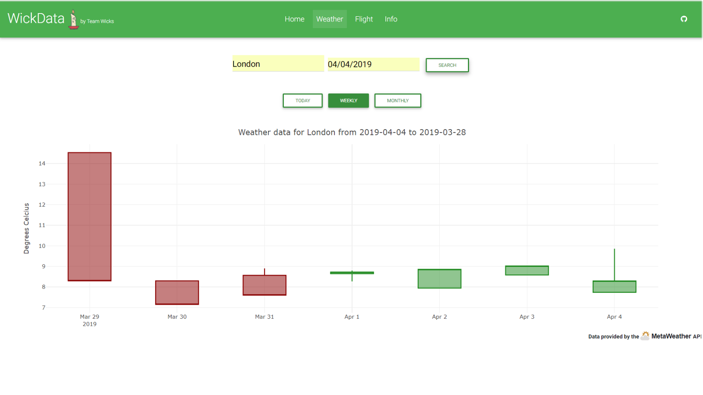
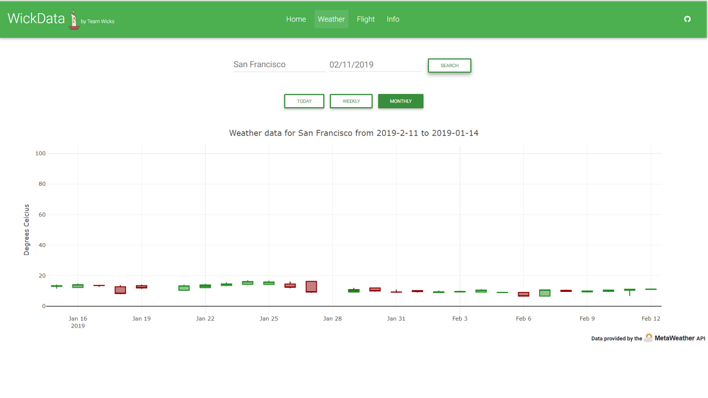
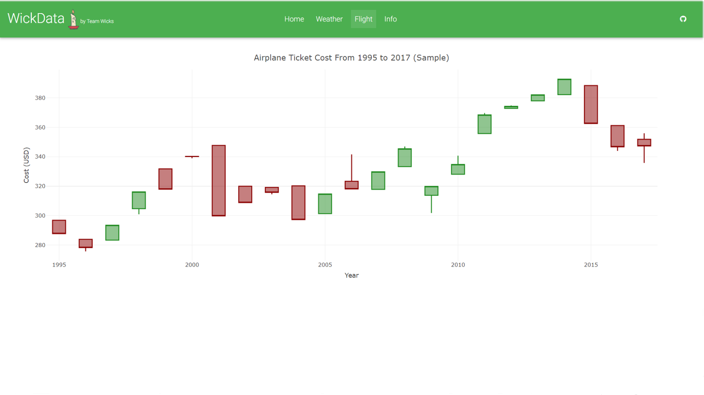
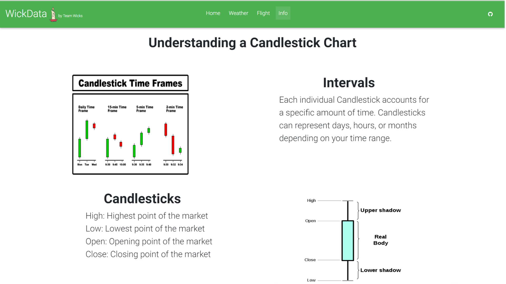

# WickData
WickData is a web platform which allows you to analyze trends in volatile data sets using candlestick charts. To date, live weather data and static airline price data is available.

## Build and run

Run `npm install` after cloning this repository to install all of the necessary dependencies. Then, run `ng serve --o` to build and run the application. Navigate to `http://localhost:4200/`. The app will automatically reload if you change any of the source files.

## Screenshots

  <strong>Home page:</strong>

  <strong>Weather:</strong>

  <strong>Airline prices:</strong> 

  <strong>Information:</strong>

